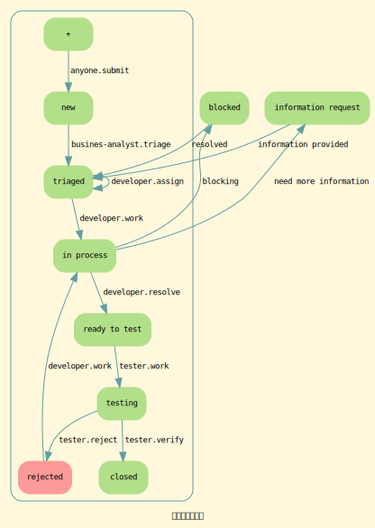

# Issue管理流程

## 原则
- 改变项目产出物的行为，必须定义一个Issue用来跟踪

## Issue的层次结构
- 史诗(epic)
  可以对应一个新特性
	可以对应一组相关的新特性
	可以对应一组bug
- 故事(story)
  可以对应一个特性
	可以对应一个特性的一组子功能
- 任务(task)
  可以对应一个特定中的一个功能
	可以对应一个特定中的一个功能的一个部分实现

可以是三层结构: epic/story/task
或者是两层结构: epic/task

## Issue的级别
- stop ship
  会导致产品的关键特性不能工作。
	比如：不能安装、不能登录等等
	在代码冻结日之后使用，这个级别被用于必须马上处理的问题。
- critical
  会导致用户不能够完成日常工作。
	在代码冻结日之前，这个级别被用于必须马上处理的问题。
	在代码冻结日之后，这个级别被用于必须处理的问题。
- high
  会导致错误的数据（主要是存储的数据）
	会导致数字安全问题的发生
	会导致一个主要功能不满足设计
- medium
  会导致一个次要功能不满足设计
- low
  一些用户交互上的次要问题，不影响数据的正确性。

## Task的常见标签
- bug
- duplicate
  （关闭）与另一个issue重复了
- enhancement
- help wanted
- invalid
  （关闭）不是一个bug
- question
- wontfix
  （关闭）是一个bug，但是将不会修

## Issue的常用状态
- new
- triage
- in process
- ready to test
- testing
- closed
- rejected
- information request
- blocked

## 任务处理流程图

